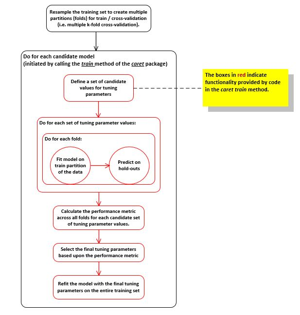

```{r setup, include=FALSE}
knitr::opts_chunk$set(echo = TRUE)
```

```{r, echo=FALSE, warning=FALSE, results='hide', message=FALSE}

# Include the R packages providing functionality used throughout in this report.
library(corrplot)
library(rpart)
library(ggplot2)
library(survival)
library(lattice)
library(splines)
library(parallel)
library(randomForest)
library(ipred)
library(e1071)
library(plyr)
library(gbm)
library(MASS)
library(klaR)
library(xgboost)
library(nnet)
library(caret)
library(knitr)
library(pander)
library(gtools)
library(gridExtra)
library(reshape2)
library(kernlab)

# Include all the functions called in this report to remove unnecessary predictors
source('C:/DMS PC Backup/Coursera Courses/Practical Machine Learning/Project/PredictorRemovalFunctions.R')

# Include all the functions called in this report to build datasets from classifier training/CV results
source('C:/DMS PC Backup/Coursera Courses/Practical Machine Learning/Project/TrainCVResultDatasetFunctions.R')

# Include all the functions called in this report to build datasets from classifier test set results
source('C:/DMS PC Backup/Coursera Courses/Practical Machine Learning/Project/TestResultDatasetFunctions.R')

```

## Synopsis

Human activity recognition (HAR) research in recent years has focused on differentiating between distinct activities.  A variant of this has been to investigate how well an activity was being performed by a research participant.  As an example, data was collected on participants wearing sensors who were then told to perform a weight lifting exercise five different ways (classified as A, B, C, D, or E).  The first class corresponds to performing the exercise "the right way", and the other classes correspond to various types of mistakes that are commonly made.  This data was then packaged into the Weight Lifting Exercise (WLE) dataset and made publicly available for further analysis.  For further details, please refer to the project website [here](http://groupware.les.inf.puc-rio.br/har#weight_lifting_exercises).  

The purpose of this report is to use the WLE dataset to build a classifier that predicts the manner in which a participant did an exercise.  It leverages functionality provided by the R caret package to pre-process and split the training data, train and cross-validate candidate models, and to compare and evaluate those models against each other.  For the sake of readability, not all of the code is displayed in this report's final output.  For those interested in reviewing the code in its entirety, please refer to the R Markdown source found [here](https://github.com/dmsimler/Practical-Machine-Learning-Project/blob/master/PMLCourseProject%20Extended.Rmd).  

**Note:**  This is an extension of a report originally completed for the Coursera Practical Machine Learning course, now repurposing the analysis to investigate and demonstrate some techniques of feature engineering.  It now includes three phases:

* Phase 0 - Handle the missing values in the WLE train/test datasets just enough to create candidate ML models.  These models will create a performance baseline (in terms of cross-validation error rate) that will be used to compare with models in subsequent phases.

* Phase 1 - Removal of correlated predictors from the WLE train/test datasets, train the same set of candidate models with this dataset, and then compare their performance with those from the baseline of Phase 0. 

* Phase 2 - Scale (standardize) the numeric predictors in the WLE train/test datasets and build new candidate models.  Performance of these classifiers is again compared to those in the baseline of Phase 0.

*****


## Processing - Phase 0
Weight Lifting Exercise data will be read in and processed below according to the following high-level steps:

1. Read downloaded copies of the Weight Lifting Exercise (WLE) data into training and test data frames  

2. Handle missing values in the training dataset enough to build models  

3. Build candidate predication models 


&nbsp;

#### 1. Read downloaded copies of the Weight Lifting Exercise (WLE) data into training and test data frames  

The WLE dataset train and test datasets were first manually downloaded to the project working directory from [here](https://d396qusza40orc.cloudfront.net/predmachlearn/pml-training.csv) and [here](https://d396qusza40orc.cloudfront.net/predmachlearn/pml-testing.csv)

The code below then reads those csv files into respective data frames:  

```{r, echo=TRUE, warning=FALSE, cache=FALSE}

# Set the current working directory to where there data file will be
setwd('C:/DMS PC Backup/Coursera Courses/Practical Machine Learning/Project')

# Set a seed value to use consistently in this document
reportSeedToUse <- 2345

# Read in the data set and convert some fields of interest to the appropriate type
wleTrainingData <- read.csv('pml-training.csv', stringsAsFactors = FALSE)

# Read in the test set at the same time
wleTestData <- read.csv('pml-testing.csv', stringsAsFactors = FALSE)

```

The types of certain key fields now need to be cast to their proper types in order to work with the analysis to follow: 

```{r, echo=TRUE, warning=FALSE}

# Cast the kurtosis, skewness, and some yaw fields, which have blanks for missing data to a numeric
for (index in c(12:17, 20, 23, 26, 69:74, 87:92, 95, 98, 101, 125:130, 133, 136, 139)) 
  wleTrainingData[, index] <- as.numeric(wleTrainingData[, index])

# Do the same for the test set
for (index in c(12:17, 20, 23, 26, 69:74, 87:92, 95, 98, 101, 125:130, 133, 136, 139)) 
  wleTestData[, index] <- as.numeric(wleTestData[, index])

# The target class field should be a factor
wleTrainingData$classe <- as.factor(wleTrainingData$classe)
wleTestData$classe <- as.factor(wleTestData$classe)

```

&nbsp;

#### 2. Handle missing values in the training dataset enough to build models

There are a few predictor types and issues in the WLE dataset that prevent creating models straight away out-of-the-base.  Those predictors/issues fall into one or more of the following categories:

* IDs or timestamps that provide no generic predictive value

* Columns that have missing values

For the second issue, where the WLE training dataset has columns with missing values, the issue is so prevelant that the "missingness" becomes relatively meaningless (i.e. it's not predictive) and attempts at imputation of some sort of meaningful default values (i.e. using caret functionality such as k-nearest-neighbor, bagged trees, or medians) were found to be useless for certain types of models (e.g. LDA).  These columns were checked for missing values by class membership (i.e. A-E) for each observation, and were discarded if the average number of missing values across all classes exceeded 95%.

Given below is a code snippet that removes these types of columns from the WLE training and test datsets:   
**NOTE:** Actual code of the functions referenced below not shown. Please refer to this report's GitHub repository if those details are required.

&nbsp;

```{r, echo=TRUE, cache=TRUE}

# First remove predictors that are IDs or timestamps that have no predictive value
colsWithTimestampsOrIDs <- c(1:7)
wleTrainingData <- wleTrainingData[, -colsWithTimestampsOrIDs]
wleTestData <- wleTestData[, -colsWithTimestampsOrIDs]

# Now remove those columns from the dataset have an average percentage of missing values per class
# above 95% 
colsWithMostlyNA <- FindColsWithMostlyNAPerClass(wleTrainingData, ncol(wleTrainingData), 0.95)
wleTrainingData <- wleTrainingData[, -colsWithMostlyNA]
wleTestData <- wleTestData[, -colsWithMostlyNA]

```

Given below is a final tally of the number of columns removed and those that still remain:

```{r, echo=TRUE}

# Print the count of columns removed and the number that are left
numColsRemoved <- length(colsWithTimestampsOrIDs) + length(colsWithMostlyNA)
print(sprintf("Number of columns removed = %d, Number of columns remaining in the training set = %d", 
              numColsRemoved, ncol(wleTrainingData)))

# Show the names of the reminaing columns in the training and test sets
colnames(wleTrainingData)

```

&nbsp;

#### 3. Build baseline candidate classifiers


##### *Process Overview* 
Shown below is the general process that will be used to split the data and train / tune candidate models using the functionality available in the *caret* R package:



&nbsp;

##### *Split the training data* 

As mentioned in the process flow-chart given above, repeated k-fold cross-validation was the strategy used to split the training data into multiple training / validation datasets.  This was chosen for the following reasons:

* Using just a single train/test set (partitioned from the original train set) is a single evaluation of the model and has limited ability to characterize the uncertainty in the results.  This is especially true for tree-based classifiers.

* Resampling methods such as this can produce reasonable predictions of how well the model will perform on future samples.

* It is generally accepted that for medium sample sizes like this one, simple 10-fold cross-validation should provide acceptable variance, low bias (difference between the estimated and true values of
performance), and is relatively quick to compute.  Research indicates that repeating k-fold crossvalidation
can be used to effectively increase the precision of the performance estimates while still maintaining a small bias.  

For this report, there will be five repetitions each with ten folds for a total of 50 different training sets and 50 hold-out sets to estimate model performance for each candidate set of tuning parameters to try for a given model:

```{r, echo=TRUE, cache=TRUE, warning=FALSE, message=FALSE}

set.seed(reportSeedToUse)
folds <- createMultiFolds(wleTrainingData$classe, k = 10, times = 5)

# Define the set of parameters to be used across all models for training and tuning
modelTrainingControl <- trainControl(method = "repeatedcv", index = folds)

```

For the folds created above, please note the following:

* Each fold contains a set of indices which are the dataset rows to train the model in question.  The holdout set (used to estimate performance) is then the set of all the other rows in the dataset.

* Each fold is randomly selected according to an internal sampling algorithm, and differs slightly from all the others (in content and sometimes in size).

* Each fold and holdout set is stratified, i.e. contains roughly the same proportion of each target class as found in the overall training set from which they were created.

Given below below is code sampling the folds to illustrate the above points:

```{r, echo=TRUE, cache=FALSE, warning=FALSE, message=FALSE}

# Show the length of each fold
sapply(folds, length)

# Show the indices in the first and middle folds as an example
folds[[1]][1:15]
folds[[25]][1:15]

# Show the class proportions in the overall training set 
table(wleTrainingData$classe) / nrow(wleTrainingData)

# Class proportions for fold 3 are stratified
table(wleTrainingData[folds[[3]], ncol(wleTrainingData)]) / length(folds[[3]])

# Class proportions for hold-out from fold 3 are stratified
table(wleTrainingData[-folds[[3]], ncol(wleTrainingData)]) / (nrow(wleTrainingData) - length(folds[[3]]))

```

&nbsp;

##### *Train / Tune candidate classifiers* 

The following candidate models will be created, trained, and cross-validated using the caret train method (which implements much of the process described above):

* A single decision tree (rpart)

* A bagged set of decision trees (treebag)

* A random forest (rf) - usually the best out-of-the-box classifier

* An extreme boosted gradient decision tree model (xgbTree) - often a winner in Kaggle competitions

* A linear disciminant analysis (lda) classifier

* A multinomial (multiclass) logistic regression (multinom) classifier

* A sigmoidal neural network with one hidden layer (nnet)

* A naive bayes (nb) classifier

* A support vector machines with radial basis function kernel (svmRadial) classifier  


First the tree-based models are trained:

```{r Phase0TreeClassifiers, echo=TRUE, cache=TRUE, warning=FALSE, message=FALSE}

set.seed(reportSeedToUse)
phase0RpartFit <- train(x = wleTrainingData[, -ncol(wleTrainingData)], y = wleTrainingData$classe,
                  method = "rpart", 
                  trControl = modelTrainingControl)

set.seed(reportSeedToUse)
phase0BaggedTreeFit <- train(x = wleTrainingData[, -ncol(wleTrainingData)], y = wleTrainingData$classe,
                       method = "treebag", 
                       trControl = modelTrainingControl)

set.seed(reportSeedToUse)
phase0RFFit <- train(x = wleTrainingData[, -ncol(wleTrainingData)], y = wleTrainingData$classe,
               method = "rf", 
               trControl = modelTrainingControl)

set.seed(reportSeedToUse)
phase0XGBoostFit <- train(x = wleTrainingData[, -ncol(wleTrainingData)], y = wleTrainingData$classe,
                    method = "xgbTree", 
                    trControl = modelTrainingControl,
                    verbose = FALSE)

```

Now build some linear classifiers:

```{r Phase0LinearClassifiers, echo=TRUE, cache=TRUE, warning=FALSE, message=FALSE, results='hide'}

set.seed(reportSeedToUse)
phase0MultinomialFit <- train(x = wleTrainingData[, -ncol(wleTrainingData)], y = wleTrainingData$classe,
                        method = "multinom", 
                        trControl = modelTrainingControl,
                        verbose = FALSE)

set.seed(reportSeedToUse)
phase0LDAFit <- train(x = wleTrainingData[, -ncol(wleTrainingData)], y = wleTrainingData$classe,
                       method = "lda", 
                       trControl = modelTrainingControl)

```

Now build a neural network with one hidden layer:

```{r Phase0NNClassifiers, echo=TRUE, cache=TRUE, warning=FALSE, message=FALSE, results='hide'}

set.seed(reportSeedToUse)
phase0NNFit <- train(x = wleTrainingData[, -ncol(wleTrainingData)], y = wleTrainingData$classe,
                        method = "nnet", 
                        trControl = modelTrainingControl,
                        verbose = FALSE)

```

Finally, build other miscellaneous non-linear classifiers of interest:

```{r Phase0MiscClassifiers, echo=TRUE, cache=TRUE, warning=FALSE, message=FALSE}

set.seed(reportSeedToUse)
phase0NaiveBayesFit <- train(x = wleTrainingData[, -ncol(wleTrainingData)], y = wleTrainingData$classe,
                       method = "nb", 
                       trControl = modelTrainingControl)

set.seed(reportSeedToUse)
phase0SVMFit <- train(x = wleTrainingData[, -ncol(wleTrainingData)], y = wleTrainingData$classe,
                method = "svmRadial", 
                trControl = modelTrainingControl)


```

&nbsp;


```{r, echo=FALSE, results='hide'}

# ---------------------------------------------------------------------------------------------------
# Make a call to create the datasets with the results of training the candidate classifiers created 
# in Phase 0.  These datasets will be used for the visualizations and analysis that follow below.
# ---------------------------------------------------------------------------------------------------

# Define the levels for the comparisons between models created in Phase 0
ModelComparisonOrderedLevelsPhase0 <- c("xgbTree - rf", "xgbTree - treebag",  
                                        "xgbTree - svmRadial", "xgbTree - nb", "xgbTree - lda", 
                                        "xgbTree - multinom", "xgbTree - rpart", "xgbTree - nnet",
                                        "rf - xgbTree", "rf - treebag", 
                                        "rf - svmRadial", "rf - nb", "rf - lda", "rf - multinom", "rf - rpart", 
                                        "rf - nnet",
                                        "treebag - xgbTree", "treebag - rf", "treebag - svmRadial",
                                        "treebag - nb", "treebag - lda", "treebag - multinom", "treebag - rpart",
                                        "treebag - nnet",
                                        "svmRadial - xgbTree", "svmRadial - rf", "svmRadial - treebag",
                                        "svmRadial - nb", "svmRadial - lda", 
                                        "svmRadial - multinom", "svmRadial - rpart", "svmRadial - nnet",
                                        "nb - xgbTree", "nb - rf", "nb - treebag", 
                                        "nb - svmRadial", "nb - lda", "nb - multinom", "nb - rpart",
                                        "nb - nnet", 
                                        "lda - xgbTree", "lda - rf", "lda - treebag", 
                                        "lda - svmRadial", "lda - nb", "lda - multinom", "lda - rpart", 
                                        "lda - nnet",
                                        "multinom - xgbTree", "multinom - rf", "multinom - treebag",
                                        "multinom - gbm", "multinom - svmRadial", "multinom - nb", 
                                        "multinom - lda", "multinom - rpart", "multinom - nnet",
                                        "rpart - xgbTree", "rpart - rf", "rpart - treebag", 
                                        "rpart - svmRadial", "rpart - nb",  "rpart - lda", 
                                        "rpart - multinom", "rpart - nnet",
                                        "nnet - xgbTree", "nnet - rf", "nnet - treebag", 
                                        "nnet - svmRadial", "nnet - nb",  "nnet - lda", 
                                        "nnet - multinom", "nnet - rpart")

# Now build the list of datasets bringing together all the modeling results for Phase 0
modelResultsPhase0 <- CreateModelPerfResultsDatasetsWWithinPhaseComparison(list(phase0RFFit, 
                                                                                phase0XGBoostFit,
                                                                                phase0BaggedTreeFit,
                                                                                phase0NaiveBayesFit, 
                                                                                phase0LDAFit,
                                                                                phase0MultinomialFit,
                                                                                phase0RpartFit, 
                                                                                phase0SVMFit,
                                                                                phase0NNFit),
                                                                           ModelComparisonOrderedLevelsPhase0)

```

*****


## Findings - Phase 0

#### Model Training / Tuning Results

First, presented below are the results of the tuning and final models:

```{r, echo=FALSE, fig.align='center', results="asis"}

panderOptions('table.alignment.default',"left")
pander(modelResultsPhase0$FinalModelSummaries, caption = "Table 1: Cross-validation errors and final model parameters for the candidate classification models created above.  The lower the cross-validation error, the more accurate is its classifier.")

```


Additionally to better visualize the estimated variance for each model, given below is a box plot of the cross-validation error rates by model in decreasing order:


```{r, echo=FALSE, fig.path="figures/", fig.align='center', fig.cap='Figure 2: Distribution of the cross-validation errors across 50 folds for the different models.  The lower (closer to zero) a distribution is, the more accurate is its classifier.', fig.height=5, fig.show='asis'}

ggplot(modelResultsPhase0$ModelCVErrors) + 
  geom_boxplot(notch=FALSE, fill="red", aes(x=Model, y=CVError)) + 
  xlab("Model Type") + ylab("CV Error")

```

#### Statistical Comparison of Models - Overview

In order to understand which models are truly the best for the WLE data, it is necessary to calculate the difference in the cross-validation (i.e. out-of-sample) errors doing pair-wise model comparisons, and then running t-tests on those pair-wise differences to determine statistical significance.

In the first step, the difference in cross-validation error between each two models (model 1 and model 2), within a set of comparisons, is calculated according to the following formula:

$CV Error Difference = CVError_{model1} - CVError_{model2}$;

A visualization in the form of a box plot is then usually provided to give the reader a sense of how the error rate varies between the models being compared.

In the second step, a t-test is performed on each model comparison's mean difference in CV error according to the following hypotheses:

$H_{0}: \mu_{CVError, model1} - \mu_{CVError, model2} = 0$;   

$H_{a}: \mu_{CVError, model1} - \mu_{CVError, model2} < 0$

For the above, the significance level $\alpha$ will need to be adjusted lower to $\alpha / m$ (i.e. the *Bonferroni correction*) in order to reject $H_{0}$ as the chance of a rare event increases with multiple comparisons, and therefore, the likelihood of incorrectly rejecting $H_{0}$ increases. Here **m** = total number of comparisons, and will vary depending upon the type of comparisons being done.  For the purposes of this experiment, please note the following:

* Comparisons will be done both between different models of the same phase (i.e. random forest vs. boosted trees, etc.) and between the same models from two different phases (i.e. random forest from phase 0 vs. random forest from phase 1).  

* For a given model comparison, there will actually be two t-tests performed: one for the case where model 1 CV error < model 2 CV error, and the other for model 2 CV error < model 1 CV error.  This is to determine which model statistically really has the lower error rate.  This is equivalent to separately answering the two questions: 1) Is this model better than that one?, and 2) Is it worse?  


&nbsp;


##### *Statistical Comparison of Baseline Models from Phase 0 (i.e. within phase comparisons)*

As described above, the boxplots of CV differences are shown below for each model comparison (grouped by a given model comparing it to all the other models trained in Phase 0):

```{r, echo=FALSE, fig.path="figures/", fig.align='center', fig.cap='Figure 3: Distribution of the difference between cross-validation errors across 50 folds for the different model pairwise comparisons', fig.height=10, fig.show='asis'}

# Make separate distinct plots for the differences between each model and all the others
rfCompPlot <- ggplot(subset(modelResultsPhase0$ModelPerfComparisons, Model1 == "rf")) + 
                     geom_boxplot(notch=FALSE, fill="red", aes(x=DiffName, y=OOSErrorDiff)) + 
                     coord_flip() + 
                     xlab("Model Pairwise Comparison") + ylab("CV Error Difference") + 
                     ggtitle("rf Comparisons")

xgbCompPlot <- ggplot(subset(modelResultsPhase0$ModelPerfComparisons, Model1 == "xgbTree")) + 
                      geom_boxplot(notch=FALSE, fill="red", aes(x=DiffName, y=OOSErrorDiff)) + 
                      coord_flip() + 
                      xlab("Model Pairwise Comparison") + ylab("CV Error Difference") +
                      ggtitle("xgbTree Comparisons")

bagCompPlot <- ggplot(subset(modelResultsPhase0$ModelPerfComparisons, Model1 == "treebag")) + 
                      geom_boxplot(notch=FALSE, fill="red", aes(x=DiffName, y=OOSErrorDiff)) + 
                      coord_flip() + 
                      xlab("Model Pairwise Comparison") + ylab("CV Error Difference") +
                      ggtitle("treebag comparisons")

svmCompPlot <- ggplot(subset(modelResultsPhase0$ModelPerfComparisons, Model1 == "svmRadial")) + 
                      geom_boxplot(notch=FALSE, fill="red", aes(x=DiffName, y=OOSErrorDiff)) + 
                      coord_flip() + 
                      xlab("Model Pairwise Comparison") + ylab("CV Error Difference") +
                      ggtitle("svm Comparisons")

nbCompPlot <- ggplot(subset(modelResultsPhase0$ModelPerfComparisons, Model1 == "nb")) + 
                     geom_boxplot(notch=FALSE, fill="red", aes(x=DiffName, y=OOSErrorDiff)) + 
                     coord_flip() + 
                     xlab("Model Pairwise Comparison") + ylab("CV Error Difference") +
                     ggtitle("nb Comparisons")
  
  
ldaCompPlot <- ggplot(subset(modelResultsPhase0$ModelPerfComparisons, Model1 == "lda")) + 
                      geom_boxplot(notch=FALSE, fill="red", aes(x=DiffName, y=OOSErrorDiff)) + 
                      coord_flip() + 
                      xlab("Model Pairwise Comparison") + ylab("CV Error Difference") +
                      ggtitle("lda Comparisons")

multinomCompPlot <- ggplot(subset(modelResultsPhase0$ModelPerfComparisons, Model1 == "multinom")) + 
                           geom_boxplot(notch=FALSE, fill="red", aes(x=DiffName, y=OOSErrorDiff)) + 
                           coord_flip() + 
                           xlab("Model Pairwise Comparison") + ylab("CV Error Difference") +
                           ggtitle("multinom Comparisons")

rpartCompPlot <- ggplot(subset(modelResultsPhase0$ModelPerfComparisons, Model1 == "rpart")) + 
                        geom_boxplot(notch=FALSE, fill="red", aes(x=DiffName, y=OOSErrorDiff)) + 
                        coord_flip() + 
                        xlab("Model Pairwise Comparison") + ylab("CV Error Difference") +
                        ggtitle("rpart Comparisons")

nnetCompPlot <- ggplot(subset(modelResultsPhase0$ModelPerfComparisons, Model1 == "nnet")) + 
                        geom_boxplot(notch=FALSE, fill="red", aes(x=DiffName, y=OOSErrorDiff)) + 
                        coord_flip() + 
                        xlab("Model Pairwise Comparison") + ylab("CV Error Difference") +
                        ggtitle("nnet Comparisons")


# Now arrange all the plots in the order of best to work model (in terms of CV Error)  
grid.arrange(rfCompPlot, xgbCompPlot, bagCompPlot, svmCompPlot, nbCompPlot, 
             ldaCompPlot, multinomCompPlot, rpartCompPlot, nnetCompPlot,
             nrow = 5, ncol = 2)

```

&nbsp;

Now, perform a t-test on each model comparison's mean difference in CV error using the *Bonferroni correction*  $\alpha / m$. Here $m = n! / (n - k)!$, where **m** = total number of comparisons, **n** = number of models, and **k** = number of models in a single comparison. Plugging in the numbers then produces the following:  
$m = 9! / (9 - 2)! = 72$  
using the standard $\alpha = 0.05$, the significance level $= 0.05 / 72 = 0.00069$

$H_{0}$ will therefore be rejected if for a given model-to-model comparison t-test, the corresponding *p-value* is less than 0.00069. In that case, the data provides convincing evidence that Model 1's error rate is actually lower than Model 2's (i.e. $H_{a}$ is true).

```{r, echo=FALSE}

rownames(modelResultsPhase0$ModelPerfAssessments) <- NULL
panderOptions('table.alignment.default',"left")
panderOptions('table.emphasize.rownames',FALSE)
pander(modelResultsPhase0$ModelPerfAssessments[, -3], 
       caption = "Table 2: Phase 0 model pair-wise t-test comparisons")

```


&nbsp;


#### Predictions on the Test Set

```{r, echo=FALSE, warning=FALSE, results='hide'}

# -------------------------------------------------------------------------------------------------------
# Create predictions on the test data by the various candidate models from Phase 0 and  
# additional datasets needed for analysis and visualization below.
# -------------------------------------------------------------------------------------------------------
phase0TestPredictionDatasets <- CreateTestPredictionDatasets(list(phase0XGBoostFit,
                                                                  phase0RFFit, 
                                                                  phase0BaggedTreeFit, 
                                                                  phase0SVMFit, 
                                                                  phase0NaiveBayesFit, 
                                                                  phase0LDAFit,
                                                                  phase0MultinomialFit, 
                                                                  phase0RpartFit,
                                                                  phase0NNFit), 
                                                             wleTestData, 
                                                             0)

```

Given below is a summary of the error rate of predictions run on the test dataset:

```{r, echo=FALSE, fig.align='center', results="asis"}

panderOptions('table.alignment.default',"left")
pander(phase0TestPredictionDatasets$ModelTestPerfSummary, caption = "Table 3: Error rate by model for predictions against a test dataset of 20 observations.")

```

&nbsp;

Additionally, shown below are heat maps of each model's predictions:

```{r, echo=FALSE, fig.path="figures/", fig.align='center', fig.cap='Figure 4: Heat map of predictions on the test set with five classes for each model type. The true classes are shown in the row labels while columns quantify the probabilities for each class (labeled A through E)', fig.height=14, fig.width=14, fig.show='asis', warning=FALSE}

# ggplot(subset(phase0TestPredictionDatasets$MeltedTestResults, Model != "svmRadial"), aes(Classe, ObservationLabel)) + 
ggplot(phase0TestPredictionDatasets$MeltedTestResults, aes(Classe, ObservationLabel)) + 
       geom_tile(aes(fill = Probability), colour = "white") + 
       scale_fill_gradient2(low = "white", high = "steelblue", guide = "legend") +
       theme_grey(base_size = 9) + 
       labs(x = "Classe Probability", y = "True Classe + Test Observation #") + 
       facet_wrap(~ Model)

```


&nbsp;


#### Conclusions 

__From the data given above, we can conclude the following:__

* *The data presented in this report provides evidence that the Extreme Gradient Boosting Tree (xgbTree) classifier has a lower CV error rate than all other candidate classifiers except for the Random Forest (rf) classifier.* However the data DOES NOT provide evidence that the Random Forest model has a lower CV error rate either.

* *The Gradient Boosted Trees and Random Forest classifiers also generalized very well to the small test set with 0 error. However, the Bagged Trees and SVM Radial classifiers that performed well on cross-validation but not the best, also generalized very well with 0 error on the test set. * 


*****


## Processing - Phase 1

Building upon the analysis performed above, WLE train/test will processed below according to the following high-level steps:

1. Reduce the number of correlated predictors in the train/test datasets  

2. Build candidate predication models with the modified training set


#### 1. Reduce the number of correlated predictors in the train/test datasets

If two predictors are correlated, this implies that they measure the same underlying information.  The assumption therefore goes that removing one of them will create simpler and more interpretable models. Given below is a code snippet that removes these pair-wise correlations from the WLE training and test datsets:   

**NOTE:** Actual code of the functions referenced below not shown. Please refer to this report's GitHub repository if those details are required.


```{r, echo=TRUE, cache=FALSE}

# Remove those columns that will reduce pair-wise correlations
colsToReduceCorrelations <- FindRemovableCorrelatedPredictors(wleTrainingData, ncol(wleTrainingData), 0.8)
reducedCorrTrainingData <- wleTrainingData[, -colsToReduceCorrelations]
reducedCorrTestData <- wleTestData[, -colsToReduceCorrelations]

```


&nbsp;


##### 2. Build candidate predication models with the modified training set

All the classifiers built in Phase 0 are now built again in this phase; the only difference being the training dataset has some of the pairwise correlated predictors removed.  Given below is the code to create those classifiers in the same groupings as above.


First the tree-based models are trained:

```{r Phase1TreeClassifiers, echo=TRUE, cache=TRUE, warning=FALSE, message=FALSE}

set.seed(reportSeedToUse)
phase1RpartFit <- train(x = reducedCorrTrainingData[, -ncol(reducedCorrTrainingData)], 
                        y = reducedCorrTrainingData$classe,
                        method = "rpart", 
                        trControl = modelTrainingControl)

set.seed(reportSeedToUse)
phase1BaggedTreeFit <- train(x = reducedCorrTrainingData[, -ncol(reducedCorrTrainingData)], 
                             y = reducedCorrTrainingData$classe, 
                             method = "treebag", 
                             trControl = modelTrainingControl)

set.seed(reportSeedToUse)
phase1RFFit <- train(x = reducedCorrTrainingData[, -ncol(reducedCorrTrainingData)], 
                     y = reducedCorrTrainingData$classe,
                     method = "rf", 
                     trControl = modelTrainingControl)

set.seed(reportSeedToUse)
phase1XGBoostFit <- train(x = reducedCorrTrainingData[, -ncol(reducedCorrTrainingData)], 
                          y = reducedCorrTrainingData$classe,
                          method = "xgbTree", 
                          trControl = modelTrainingControl,
                          verbose = FALSE)

```

Now build the linear classifiers:

```{r Phase1LinearClassifiers, echo=TRUE, cache=TRUE, warning=FALSE, message=FALSE, results='hide'}

set.seed(reportSeedToUse)
phase1MultinomialFit <- train(x = reducedCorrTrainingData[, -ncol(reducedCorrTrainingData)], 
                              y = reducedCorrTrainingData$classe,
                              method = "multinom", 
                              trControl = modelTrainingControl,
                              verbose = FALSE)

set.seed(reportSeedToUse)
phase1LDAFit <- train(x = reducedCorrTrainingData[, -ncol(reducedCorrTrainingData)], 
                      y = reducedCorrTrainingData$classe,
                      method = "lda", 
                      trControl = modelTrainingControl)

```

Now build a neural network with one hidden layer:

```{r Phase1NNClassifiers, echo=TRUE, cache=TRUE, warning=FALSE, message=FALSE, results='hide'}

set.seed(reportSeedToUse)
phase1NNFit <- train(x = reducedCorrTrainingData[, -ncol(reducedCorrTrainingData)], 
                     y = reducedCorrTrainingData$classe,
                        method = "nnet", 
                        trControl = modelTrainingControl,
                        verbose = FALSE)

```


Finally, build other miscellaneous non-linear classifiers of interest:

```{r Phase1MiscClassifiers, echo=TRUE, cache=TRUE, warning=FALSE, message=FALSE}

set.seed(reportSeedToUse)
phase1NaiveBayesFit <- train(x = reducedCorrTrainingData[, -ncol(reducedCorrTrainingData)], 
                             y = reducedCorrTrainingData$classe,
                             method = "nb", 
                             trControl = modelTrainingControl)

set.seed(reportSeedToUse)
phase1SVMFit <- train(x = reducedCorrTrainingData[, -ncol(reducedCorrTrainingData)], 
                      y = reducedCorrTrainingData$classe,
                      method = "svmRadial", 
                      trControl = modelTrainingControl)


```

&nbsp;


```{r, echo=FALSE, results='hide'}

# ---------------------------------------------------------------------------------------------------
# Make a call to create the datasets with the results of training the candidate classifiers created 
# in Phase 0.  These datasets will be used for the visualizations and analysis that follow below.
# ---------------------------------------------------------------------------------------------------

# -------------------------------------------------------------------------------------------------------
# Define the model comparisons between Phase 1 to Phase 0
# -------------------------------------------------------------------------------------------------------
ModelComparisonOrderedLevelsPhase1 <- c("multinom1 - multinom0",  "lda1 - lda0", "nnet1 - nnet0", 
                                        "svmRadial1 - svmRadial0", "treebag1 - treebag0", "xgbTree1 - xgbTree0", 
                                        "rf1 - rf0", "rpart1 - rpart0", "nb1 - nb0", 
                                        "nb0 - nb1", "rpart0 - rpart1", "rf0 - rf1", "xgbTree0 - xgbTree1", 
                                        "treebag0 - treebag1",  "svmRadial0 - svmRadial1", "nnet0 - nnet1", 
                                        "lda0 - lda1", "multinom0 - multinom1") 


# Now build the list of datasets bringing together all the modeling results for Phase 0
modelResultsPhase1 <- CreateModelPerfResultsDatasetsWBetweenPhaseComparison(list(phase1RFFit, phase1XGBoostFit,
                                                                                 phase1BaggedTreeFit,
                                                                                 phase1NaiveBayesFit, 
                                                                                 phase1LDAFit,
                                                                                 phase1MultinomialFit,
                                                                                 phase1RpartFit, 
                                                                                 phase1SVMFit,
                                                                                 phase1NNFit),
                                                                            modelResultsPhase0$ModelCVErrors,
                                                                            1,
                                                                            0,
                                                                            ModelComparisonOrderedLevelsPhase1)
 
```


*****


## Findings - Phase 1

#### Model Training / Tuning Results

First, presented below are the results of the tuning and final models for this phase:

```{r, echo=FALSE, fig.align='center', results="asis"}

panderOptions('table.alignment.default',"left")
pander(modelResultsPhase1$FinalModelSummaries, caption = "Table 4: Cross-validation errors and final model parameters for the candidate classification models created above.  The lower the cross-validation error, the more accurate is its classifier.")

```


Additionally to better visualize the estimated variance for each model, given below is a box plot of the cross-validation error rates by model in decreasing order:


```{r, echo=FALSE, fig.path="figures/", fig.align='center', fig.cap='Figure 5: Distribution of the cross-validation errors across 50 folds for the different models.  The lower (closer to zero) a distribution is, the more accurate is its classifier.', fig.height=5, fig.show='asis'}

ggplot(modelResultsPhase1$ModelCVErrors) + 
  geom_boxplot(notch=FALSE, fill="red", aes(x=Model, y=CVError)) + 
  xlab("Model Type") + ylab("CV Error")

```

&nbsp;

#### Statistical Comparison of Models

Instead of comparing all of the models trained in Phase 1 with each other, we are going to instead compare a model trained in Phase 1 with the same model type in Phase 0 (the baseline) to see if reducing correlated predictor pairs makes results better or worse.  We will need to check both cases (better and worse) by doing all of the t-test comparisons together, but will present the outcome separately for readability.  

Again keeping the *Bonferroni correction* in mind, the significance values used for each of the t-tests will be different this time, i.e. the significance level $= 0.05 / 18 = 0.0028$.  18 is the total number of model comparisons calculated as $m_{Total} = n * m_{ComparisonsPerModel}$ where $n = 9$ is the number of models each with $m_{ComparisonsPerModel} = 2$ comparisons: Phase 1 Mean CV Error < Phase 0 Mean CV Error, and Phase 0 Mean CV Error < Phase 1 Mean CV Error for the model in question.


&nbsp;


##### *Comparing Phase 1 models with the same Phase 0 models - Are any Phase 1 models better?*

As described above, the boxplots of the distribution of the differences *Phase 1 CV Error - Phase 0 CV Error* taken for each fold are shown below for each model comparison:

```{r Phase1BPCompBetter, echo=FALSE, fig.path="figures/", fig.align='center', fig.cap='Figure 6: Distribution of the difference between CV errors across 50 folds for the different model pairwise comparisons', fig.height=6, fig.show='asis', warning=FALSE}

# -------------------------------------------------------------------------------------------------------
# Make a single plot showing the difference in CV error rate taken between the Phase 1 and Phase 0 versions of 
# each model type.
# -------------------------------------------------------------------------------------------------------
ggplot(subset(modelResultsPhase1$PhasePerfComparisons, ComparesCurrentToPrevious == TRUE)) + 
       geom_boxplot(notch=FALSE, fill="red", aes(x=DiffName, y=CVErrorDiff)) + 
       coord_flip() + 
       xlab("Model Pairwise Comparison") + ylab("Mean cv Error Difference") + 
       ggtitle("Phase 1 - Phase 0 Model Differences")

```

&nbsp;

Additionally, t-tests are performed to determine the statistical significance of any differences testing for the following set of hypotheses:  

$H_{0}: \mu_{CVError, Phase 1 model{i}} - \mu_{CVError, Phase 0 model{i}} = 0$;  

$H_{a}: \mu_{CVError, Phase 1 model{i}} - \mu_{CVError, Phase 0 model{i}} < 0$


```{r Phase1TTestBetter, echo=FALSE}

# Grab only the current phase to the baseline phase comparisons (not the other way around)
currentToPreviousPhaseComparisons <- subset(modelResultsPhase1$PhasePerfAssessments, 
                                            ComparesCurrentToPrevious == TRUE)[, -c(3, 8)]
rownames(currentToPreviousPhaseComparisons) <- NULL

# Display a table of the t-test results of the comparisons across phases
panderOptions('table.alignment.default',"left")
panderOptions('table.emphasize.rownames',FALSE)
pander(currentToPreviousPhaseComparisons, 
       caption = "Table 5: Pair-wise t-test comparisons for the same model types from Phase 1 to Phase 0")

```

&nbsp;


##### *Comparing Phase 1 Models with Phase 0 - Are any Phase 0 models better?*

Now comparing in the opposite direction, the boxplots of the distribution of the differences *Phase 0 CV Error - Phase 1 CV Error* taken for each fold are shown below for each model comparison:

```{r Phase1BPCompWorse, echo=FALSE, fig.path="figures/", fig.align='center', fig.cap='Figure 6: Distribution of the difference between CV errors across 50 folds for the different model pairwise comparisons', fig.height=6, fig.show='asis', warning=FALSE}

# -------------------------------------------------------------------------------------------------------
# Make a single plot showing the difference in CV error rate taken between the Phase 1 and Phase 0 versions of 
# each model type.
# -------------------------------------------------------------------------------------------------------
ggplot(subset(modelResultsPhase1$PhasePerfComparisons, ComparesCurrentToPrevious == FALSE)) + 
       geom_boxplot(notch=FALSE, fill="red", aes(x=DiffName, y=CVErrorDiff)) + 
       coord_flip() + 
       xlab("Model Pairwise Comparison") + ylab("Mean cv Error Difference") + 
       ggtitle("Phase 0 - Phase 1 Model Differences")

```


&nbsp;


Additionally, t-tests are performed to determine the statistical significance of any differences testing for the following set of hypotheses:  

$H_{0}: \mu_{CVError, Phase 0 model{i}} - \mu_{CVError, Phase 1 model{i}} = 0$;  

$H_{a}: \mu_{CVError, Phase 0 model{i}} - \mu_{CVError, Phase 1 model{i}} < 0$


```{r Phase1TTestWorse, echo=FALSE}


# Grab only the baseline to current phase phase comparisons (not the other way around)
previousToCurrentPhaseComparisons <- subset(modelResultsPhase1$PhasePerfAssessments, 
                                            ComparesCurrentToPrevious == FALSE)[, -c(3, 8)]
rownames(previousToCurrentPhaseComparisons) <- NULL

# Display a table of the t-test results of the comparisons across phases
panderOptions('table.alignment.default',"left")
panderOptions('table.emphasize.rownames',FALSE)
pander(previousToCurrentPhaseComparisons, 
       caption = "Table 5: Pair-wise t-test comparisons for the same model types from Phase 1 to Phase 0")

```


&nbsp;


#### Predictions on the Test Set

```{r, echo=FALSE, warning=FALSE, results='hide'}

# -------------------------------------------------------------------------------------------------------
# Create predictions on the test data by the various candidate models from Phase 1 and  
# additional datasets needed for analysis and visualization below.
# -------------------------------------------------------------------------------------------------------
phase1TestPredictionDatasets <- CreateTestPredictionDatasets(list(phase1XGBoostFit,
                                                                  phase1RFFit, 
                                                                  phase1BaggedTreeFit, 
                                                                  phase1SVMFit, 
                                                                  phase1NaiveBayesFit, 
                                                                  phase1MultinomialFit, 
                                                                  phase1LDAFit,
                                                                  phase1NNFit,
                                                                  phase1RpartFit), 
                                                             reducedCorrTestData, 
                                                             1,
                                                             phase0TestPredictionDatasets$ModelTestPerfSummary,
                                                             0)

```


Given below is a summary of the error rate of predictions run on the test dataset:

```{r, echo=FALSE, fig.align='center', results="asis"}

panderOptions('table.alignment.default',"left")
pander(phase1TestPredictionDatasets$ModelTestPerfSummary, caption = "Table 6: Error rate by model for predictions against a test dataset of 20 observations.")

```

&nbsp;

Additionally, shown below are heat maps of each model's predictions:

```{r, echo=FALSE, fig.path="figures/", fig.align='center', fig.cap='Figure 7: Heat map of predictions on the test set with five classes for each model type. The true classes are shown in the row labels while columns quantify the probabilities for each class (labeled A through E)', fig.height=14, fig.width=14, fig.show='asis', warning=FALSE}

# ggplot(subset(phase0TestPredictionDatasets$MeltedTestResults, Model != "svmRadial"), aes(Classe, ObservationLabel)) + 
ggplot(phase1TestPredictionDatasets$MeltedTestResults, aes(Classe, ObservationLabel)) + 
       geom_tile(aes(fill = Probability), colour = "white") + 
       scale_fill_gradient2(low = "white", high = "steelblue", guide = "legend") +
       theme_grey(base_size = 9) + 
       labs(x = "Classe Probability", y = "True Classe + Test Observation #") + 
       facet_wrap(~ Model)

```


&nbsp;


#### Conclusions 

__From the data given above, we can conclude the following:__

* *In this phase, the classifier with the lowest error rate was the Random Forest (as opposed to Phase 0 where it was the Gradient Boosted Tree).  The classifier with the highest error rate was again the Single Hidden Layer Neural Net (nnet - although its error rate was slightly lower this time).* 

* *The data presented in this report provides evidence that training on a dataset where all correlated predictor pairs were removed from the Phase 0 training set, yielded classifiers that actually performed WORSE (i.e. had a higher CV error rate) than those created in Phase 0 for the following models: Random Forest (rf), eXtreme Gradient Boosted Trees (xgbTree), Bagged Trees (treeBag), Linear Discriminant Analysis (lda), Multinomial Logistic Regression (multinom), and Support Vector Machine with Radial Basis Function Kernal (svmRadial).* 

* *The evidence also shows that only the Naive Bayes (nb) classifier actually lowered its error rate (by ~2%) when correlated predictors were removed from the Phase 0 training set. * 

* *Despite the statistically significant decrease in performance, the four classifiers with the lowest CV errors (rf, xgbTree, treeBag, and svmRadial) still generalized very well to the small test set with 0% error as in Phase 0. The Multinomial Logistic Regression (multinom), Single Hidden Layer Neural Net (nnet), and RPart Decision Tree (rpart) classifiers saw their error rates reduced by 5% or more (to .35, .45, and .55 respectively). Only the LDA classifier showed worse performance (error rate up 10% from .3 to .4)* 


*****


## Processing - Phase 2
The objective of this phase is to perform standarization on numeric features in the WLE dataset and see if it has any impact on the performance of any of the models previously built.  Processing will be done according to the following high-level steps:

1. Scale (standardize) numeric predictors in the WLE dataset.  Further details on the background of this can be found [here](http://sebastianraschka.com/Articles/2014_about_feature_scaling.html).

2. Build candidate predication models 

&nbsp;

#### 1. Scale (standardize) numeric predictors in the WLE dataset


```{r, echo=TRUE, warning=FALSE}

wlePreProcValues <- preProcess(wleTrainingData, method = c("center", "scale"))
standardizedTrainingData <- predict(wlePreProcValues, wleTrainingData)
standardizedTestData <- predict(wlePreProcValues, wleTestData)

# Give an example of the difference between the base training set and the scaled one, for the first 5 columns
# (all of which are numeric)
head(wleTrainingData[, c(1:5)])
head(standardizedTrainingData[, c(1:5)])

```


&nbsp;

##### 2. Build candidate predication models with the modified training set

All the classifiers built in previous phases are now built here again; the only difference being the training dataset has some of the pairwise correlated predictors removed.  Given below is the code to create those classifiers in the same groupings as above.


First the tree-based models are trained:

```{r Phase2TreeClassifiers, echo=TRUE, cache=TRUE, warning=FALSE, message=FALSE}

set.seed(reportSeedToUse)
phase2RpartFit <- train(x = standardizedTrainingData[, -ncol(standardizedTrainingData)], 
                        y = standardizedTrainingData$classe,
                        method = "rpart", 
                        trControl = modelTrainingControl)

set.seed(reportSeedToUse)
phase2BaggedTreeFit <- train(x = standardizedTrainingData[, -ncol(standardizedTrainingData)], 
                             y = standardizedTrainingData$classe, 
                             method = "treebag", 
                             trControl = modelTrainingControl)

set.seed(reportSeedToUse)
phase2RFFit <- train(x = standardizedTrainingData[, -ncol(standardizedTrainingData)], 
                     y = standardizedTrainingData$classe,
                     method = "rf", 
                     trControl = modelTrainingControl)

set.seed(reportSeedToUse)
phase2XGBoostFit <- train(x = standardizedTrainingData[, -ncol(standardizedTrainingData)], 
                          y = standardizedTrainingData$classe,
                          method = "xgbTree", 
                          trControl = modelTrainingControl,
                          verbose = FALSE)

```

Now build the linear classifiers:

```{r Phase2LinearClassifiers, echo=TRUE, cache=TRUE, warning=FALSE, message=FALSE, results='hide'}

set.seed(reportSeedToUse)
phase2MultinomialFit <- train(x = standardizedTrainingData[, -ncol(standardizedTrainingData)], 
                              y = standardizedTrainingData$classe,
                              method = "multinom", 
                              trControl = modelTrainingControl,
                              verbose = FALSE)

set.seed(reportSeedToUse)
phase2LDAFit <- train(x = standardizedTrainingData[, -ncol(standardizedTrainingData)], 
                      y = standardizedTrainingData$classe,
                      method = "lda", 
                      trControl = modelTrainingControl)

```


Now build a neural network with one hidden layer:

```{r Phase2NNClassifiers, echo=TRUE, cache=TRUE, warning=FALSE, message=FALSE, results='hide'}

set.seed(reportSeedToUse)
phase2NNFit <- train(x = standardizedTrainingData[, -ncol(standardizedTrainingData)], 
                     y = standardizedTrainingData$classe,
                        method = "nnet", 
                        trControl = modelTrainingControl,
                        verbose = FALSE)

```

Finally, build other miscellaneous non-linear classifiers of interest:

```{r Phase2MiscClassifiers, echo=TRUE, cache=TRUE, warning=FALSE, message=FALSE}

set.seed(reportSeedToUse)
phase2NaiveBayesFit <- train(x = standardizedTrainingData[, -ncol(standardizedTrainingData)], 
                             y = standardizedTrainingData$classe,
                             method = "nb", 
                             trControl = modelTrainingControl)

set.seed(reportSeedToUse)
phase2SVMFit <- train(x = standardizedTrainingData[, -ncol(standardizedTrainingData)], 
                      y = standardizedTrainingData$classe,
                      method = "svmRadial", 
                      trControl = modelTrainingControl)


```

&nbsp;


```{r, echo=FALSE, results='hide'}

# -------------------------------------------------------------------------------------------------------
# Define the model comparisons between Phase 2 to Phase 0
# -------------------------------------------------------------------------------------------------------
ModelComparisonOrderedLevelsPhase2 <- c("xgbTree2 - xgbTree0", "rf2 - rf0", "treebag2 - treebag0", 
                                        "svmRadial2 - svmRadial0", "nb2 - nb0", 
                                        "lda2 - lda0", "rpart2 - rpart0",
                                        "multinom2 - multinom0", "nnet2 - nnet0",
                                        "nnet0 - nnet2", "multinom0 - multinom2", "rpart0 - rpart2",
                                        "lda0 - lda2", "nb0 - nb2", "svmRadial0 - svmRadial2",
                                        "treebag0 - treebag2", "rf0 - rf2", "xgbTree0 - xgbTree2") 


# Now build the list of datasets bringing together all the modeling results for Phase 2
modelResultsPhase2 <- CreateModelPerfResultsDatasetsWBetweenPhaseComparison(list(phase2RFFit, 
                                                                                phase2XGBoostFit,
                                                                                phase2BaggedTreeFit,
                                                                                phase2NaiveBayesFit, 
                                                                                phase2LDAFit,
                                                                                phase2MultinomialFit,
                                                                                phase2RpartFit, 
                                                                                phase2SVMFit,
                                                                                phase2NNFit),
                                                                           modelResultsPhase0$ModelCVErrors,
                                                                           2,
                                                                           0,
                                                                           ModelComparisonOrderedLevelsPhase2)
 

```


*****


## Findings - Phase 2

#### Model Training / Tuning Results

First, presented below are the results of the tuning and final models for this phase:

```{r, echo=FALSE, fig.align='center', results="asis"}

panderOptions('table.alignment.default',"left")
pander(modelResultsPhase2$FinalModelSummaries, caption = "Table 7: Cross-validation errors and final model parameters for the candidate classification models created above.  The lower the cross-validation error, the more accurate is its classifier.")

```


Additionally to better visualize the estimated variance for each model, given below is a box plot of the cross-validation error rates by model in decreasing order:


```{r, echo=FALSE, fig.path="figures/", fig.align='center', fig.cap='Figure 8: Distribution of the cross-validation errors across 50 folds for the different models.  The lower (closer to zero) a distribution is, the more accurate is its classifier.', fig.height=5, fig.show='asis'}

ggplot(modelResultsPhase2$ModelCVErrors) + 
  geom_boxplot(notch=FALSE, fill="red", aes(x=Model, y=CVError)) + 
  xlab("Model Type") + ylab("CV Error")

```
#### Statistical Comparison of Models

Just like in Phase 1, here all of the models trained in Phase 2 with the same model type in Phase 0 (the baseline) to see if standardizing numeric predictors makes results better or worse.  We will need to check both cases (better and worse) by doing all of the t-test comparisons together, but will present the outcome separately for readability.  

Again keeping the *Bonferroni correction* in mind, the significance values used for each of the t-tests will be different this time, i.e. the significance level $= 0.05 / 18 = 0.0028$.  18 is the total number of model comparisons calculated as $m_{Total} = n * m_{ComparisonsPerModel}$ where $n = 9$ is the number of models each with $m_{ComparisonsPerModel} = 2$ comparisons: Phase 2 Mean CV Error < Phase 0 Mean CV Error, and Phase 0 Mean CV Error < Phase 2 Mean CV Error for the model in question.


&nbsp;


##### *Comparing Phase 2 models with the same Phase 0 models - Are any Phase 2 models better?*

As described above, the boxplots of the distribution of the differences *Phase 2 CV Error - Phase 0 CV Error* taken for each fold are shown below for each model comparison:

```{r Phase2BPCompBetter, echo=FALSE, fig.path="figures/", fig.align='center', fig.cap='Figure 9: Distribution of the difference between CV errors across 50 folds for the different model pairwise comparisons', fig.height=6, fig.show='asis', warning=FALSE}

# -------------------------------------------------------------------------------------------------------
# Make a single plot showing the difference in CV error rate taken between the Phase 1 and Phase 0 versions of 
# each model type.
# -------------------------------------------------------------------------------------------------------
ggplot(subset(modelResultsPhase2$PhasePerfComparisons, ComparesCurrentToPrevious == TRUE)) + 
       geom_boxplot(notch=FALSE, fill="red", aes(x=DiffName, y=CVErrorDiff)) + 
       coord_flip() + 
       xlab("Model Pairwise Comparison") + ylab("Mean cv Error Difference") + 
       ggtitle("Phase 2 - Phase 0 Model Differences")

```

&nbsp;

Additionally, t-tests are performed to determine the statistical significance of any differences testing for the following set of hypotheses:  

$H_{0}: \mu_{CVError, Phase 2 model{i}} - \mu_{CVError, Phase 0 model{i}} = 0$;  

$H_{a}: \mu_{CVError, Phase 2 model{i}} - \mu_{CVError, Phase 0 model{i}} < 0$


```{r Phase2TTestBetter, echo=FALSE}

# Grab only the current phase to the baseline phase comparisons (not the other way around)
currentToPreviousPhaseComparisons <- subset(modelResultsPhase2$PhasePerfAssessments, 
                                            ComparesCurrentToPrevious == TRUE)[, -c(3, 8)]
rownames(currentToPreviousPhaseComparisons) <- NULL

# Display a table of the t-test results of the comparisons across phases
panderOptions('table.alignment.default',"left")
panderOptions('table.emphasize.rownames',FALSE)
pander(currentToPreviousPhaseComparisons, 
       caption = "Table 8: Pair-wise t-test comparisons for the same model types from Phase 2 to Phase 0")

```

&nbsp;


##### *Comparing Phase 2 Models with Phase 0 - Are any Phase 0 models better?*

Now comparing in the opposite direction, the boxplots of the distribution of the differences *Phase 0 CV Error - Phase 1 CV Error* taken for each fold are shown below for each model comparison:

```{r Phase2BPCompWorse, echo=FALSE, fig.path="figures/", fig.align='center', fig.cap='Figure 10: Distribution of the difference between CV errors across 50 folds for the different model pairwise comparisons', fig.height=6, fig.show='asis', warning=FALSE}

# -------------------------------------------------------------------------------------------------------
# Make a single plot showing the difference in CV error rate taken between the Phase 1 and Phase 0 versions of 
# each model type.
# -------------------------------------------------------------------------------------------------------
ggplot(subset(modelResultsPhase2$PhasePerfComparisons, ComparesCurrentToPrevious == FALSE)) + 
       geom_boxplot(notch=FALSE, fill="red", aes(x=DiffName, y=CVErrorDiff)) + 
       coord_flip() + 
       xlab("Model Pairwise Comparison") + ylab("Mean cv Error Difference") + 
       ggtitle("Phase 0 - Phase 2 Model Differences")

```


&nbsp;


Additionally, t-tests are performed to determine the statistical significance of any differences testing for the following set of hypotheses:  

$H_{0}: \mu_{CVError, Phase 0 model{i}} - \mu_{CVError, Phase 2 model{i}} = 0$;  

$H_{a}: \mu_{CVError, Phase 0 model{i}} - \mu_{CVError, Phase 2 model{i}} < 0$


```{r Phase2TTestWorse, echo=FALSE}


# Grab only the baseline to current phase phase comparisons (not the other way around)
previousToCurrentPhaseComparisons <- subset(modelResultsPhase2$PhasePerfAssessments, 
                                            ComparesCurrentToPrevious == FALSE)[, -c(3, 8)]
rownames(previousToCurrentPhaseComparisons) <- NULL

# Display a table of the t-test results of the comparisons across phases
panderOptions('table.alignment.default',"left")
panderOptions('table.emphasize.rownames',FALSE)
pander(previousToCurrentPhaseComparisons, 
       caption = "Table 5: Pair-wise t-test comparisons for the same model types from Phase 1 to Phase 0")

```


&nbsp;


#### Predictions on the Test Set - Phase 2

```{r, echo=FALSE, warning=FALSE, results='hide'}

# -------------------------------------------------------------------------------------------------------
# Create predictions on the test data by the various candidate models from Phase 2 and  
# additional datasets needed for analysis and visualization below.
# -------------------------------------------------------------------------------------------------------
phase2TestPredictionDatasets <- CreateTestPredictionDatasets(list(phase2XGBoostFit,
                                                                  phase2RFFit, 
                                                                  phase2BaggedTreeFit, 
                                                                  phase2SVMFit, 
                                                                  phase2MultinomialFit, 
                                                                  phase2LDAFit,
                                                                  phase2NaiveBayesFit,
                                                                  phase2NNFit,
                                                                  phase2RpartFit), 
                                                             standardizedTestData,
                                                             2,
                                                             phase0TestPredictionDatasets$ModelTestPerfSummary,
                                                             0)

```


Given below is a summary of the error rate of predictions run on the test dataset:

```{r, echo=FALSE, fig.align='center', results="asis"}

panderOptions('table.alignment.default',"left")
pander(phase2TestPredictionDatasets$ModelTestPerfSummary, caption = "Table 8: Error rate by model for predictions against a test dataset of 20 observations.")

```

&nbsp;

Additionally, shown below are heat maps of each model's predictions:

```{r, echo=FALSE, fig.path="figures/", fig.align='center', fig.cap='Figure 11: Heat map of predictions on the test set with five classes for each model type. The true classes are shown in the row labels while columns quantify the probabilities for each class (labeled A through E)', fig.height=14, fig.width=14, fig.show='asis', warning=FALSE}

# ggplot(subset(phase0TestPredictionDatasets$MeltedTestResults, Model != "svmRadial"), aes(Classe, ObservationLabel)) + 
ggplot(phase2TestPredictionDatasets$MeltedTestResults, aes(Classe, ObservationLabel)) + 
       geom_tile(aes(fill = Probability), colour = "white") + 
       scale_fill_gradient2(low = "white", high = "steelblue", guide = "legend") +
       theme_grey(base_size = 9) + 
       labs(x = "Classe Probability", y = "True Classe + Test Observation #") + 
       facet_wrap(~ Model)

```


&nbsp;


#### Conclusions 

__From the data given above, we can conclude the following:__

* *In this phase, the classifier with the lowest error rate was the was the Gradient Boosted Tree (0.003659).  The classifier with the highest error rate was the RPart decision tree (.4943).* 

* *The data presented in this report provides evidence that training on a dataset where all numeric predictors were standardized ONLY reduces the error for the Mulinomial Logistic Regression (multinom) and Single Hidden Layer Neural Network (nnet) classifiers.*  This was a bit of a surprise, as it was expected that the Naive Bayes, LDA, and SVM classifiers would show improvement in their error rates.  It is possible that internally some of these classifiers are already doing the scaling on the training sets, in which case scaling as part of pre-processing upstream from training would be unnecessary. 

* *The Multinomial Logistic Regression (multinom) and Single Hidden Layer Neural Network (nnet) classifiers also showed significant reduction in their test error, down 15% (from .4 to .25) and 25% (from  .6 to .35) respectively from Phase 0 to Phase 2. All other classifiers had no change in their error rates from Phase 0 to Phase 2.* 


*****


